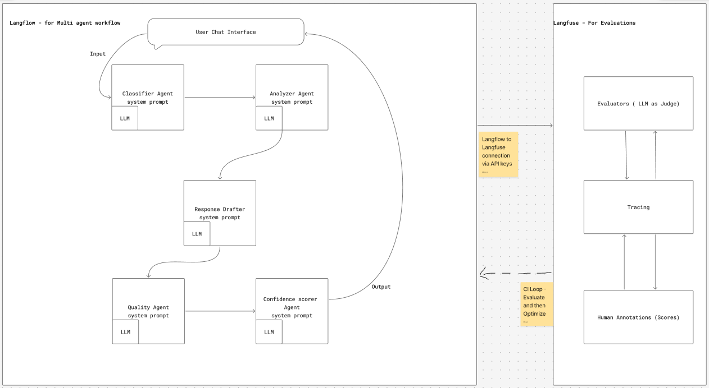
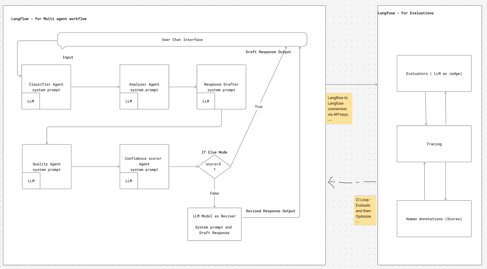

# Support-Ticket-Agentic-Workflow-Evaluation
A simple customer support ticket classifier and responder workflow will be built on Langflow and evaluated on Langfuse. Highlighting the significance of evaluations on non deterministic agentic workflows and its impact to building more reliable AI pipelines.

# Evaluations and Optimization
The non deterministic nature of the Agentic workflows makes evaluation a crucial step in delivering highly reliable AI soultions.In general workflows are evaluated Offline(before deployment) and Online(Production instance) for Continuous improvement.
There are three ways to apporaching evaluations.
  1. Self Evaluating Agents - While we create guardrails and feedback loops within the workflow it carries a risk of **bias** given the agent is evaluating itself.
  2. LLM-as-Judge - Provides as an external Agent that evaluates a worflow as a judge ( The LLM chosen as judge is recommended to be a different model than the ones in workflow) to evaluate the results without any bias.
  3. Humman Annotations - Although human reviews are the most reliable, In a Production scale and Online evaluations these introduce too much latency and are not suitable for coninuos monitoring and improvement.

Instead of choosing only one evaluation technique, combination of these approaches are usually best suited to provide effecting monitoring, debugging and optimizing the solutions. 

Optimization loop-  we choose a metric, diagnose failure modes, change one of the parameters (prompt rules, retrieval/context, routing/guardrails, or model), and re-run the same dataset to verify improvement in quality, cost, and latency. 

# Problem Statement
Customer support teams at SaaS companies are drowning. Ticket volumes keep rising, response times are slow, customers are frustrated, and support agents are burning out from repetitive triage work.
Many companies are now building AI-powered systems to help: automatically classify incoming tickets, assess urgency, and draft initial responses for human agents to review and send.
Building these AI systems is straightforward. The hard part is making sure they are trustworthy. Specifically:

•	When a customer sends a vague complaint like "nothing works, fix it" — the AI should ask for more details, not invent a solution.
•	When a customer reports a billing error — the AI should acknowledge the issue, not promise a refund that nobody approved.
•	When a customer sends just the word "help" — the AI should not fabricate a three-paragraph response about password resets.

This problem is called hallucination — the AI generating confident, professional-sounding information that is completely made up. It is the single biggest risk in deploying AI for customer-facing tasks.

# Goal
Making agentic systems measurable and improvable. Build an agentic workflow that caters to the Customer support ticket classification and response.Evaluate a this multi-agent pipeline using observability(traces), quality scoring, and human review, then turn those insights into concrete optimizations.

# Solution
Create a Multi agent pipeline on **Langflow**. Connect this pipeline to **Langfuse** to see exactly what each agent does (tracing). Then set up automated evaluators that score every response for faithfulness (are the facts real?) and safety (is the input an attack?) using OpenAI LLM. Also Use Human annotation scoring for additional evaluation.

**Baseline Version** - A linear simple pipeline with system prompts as shown below.

**Optimized Version** - Added a feedback loop and a separate language model reviser agent for improving responses of the existing pipeline to act as a quality gate for improving the faithfulness and groundedness scores.Improved prompt quality to further enhace and optimize the responses especially to handle vague user prompts along with valid requests.

**Score Card Comparision over time**
Showing the Faithfulness increase from **0.6 to 0.8** from baseline to optimized version.

Dashboard for overall Analysis

# System Design

Baseline Vs Optimized
 Vs 

# Optimization Strategy

